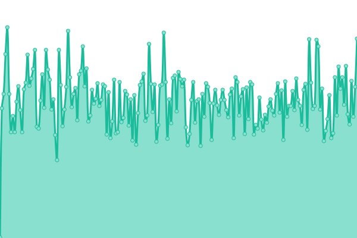
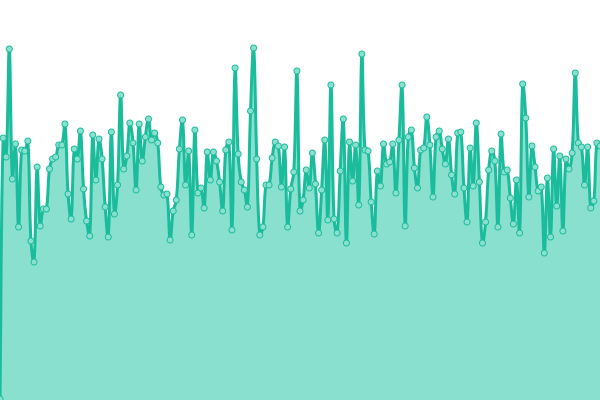
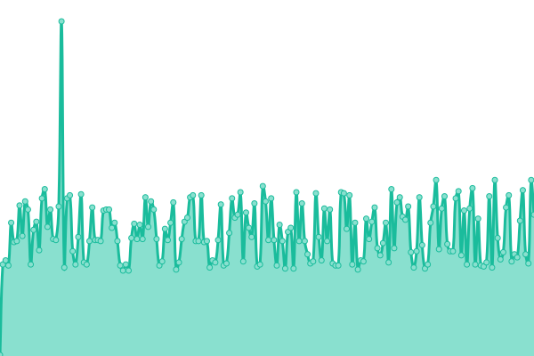
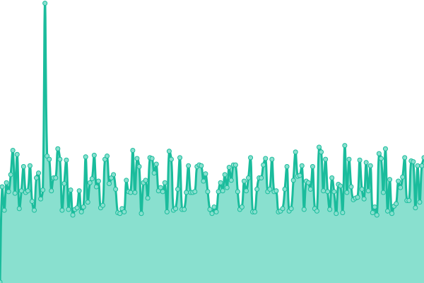
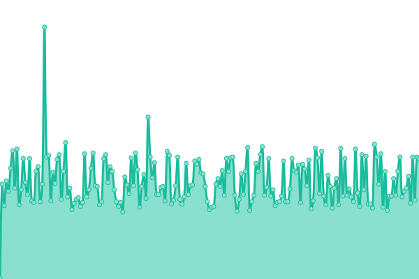
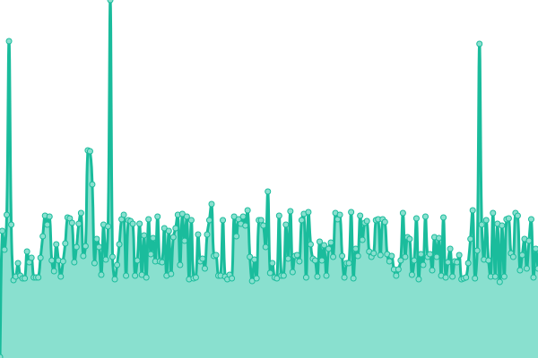
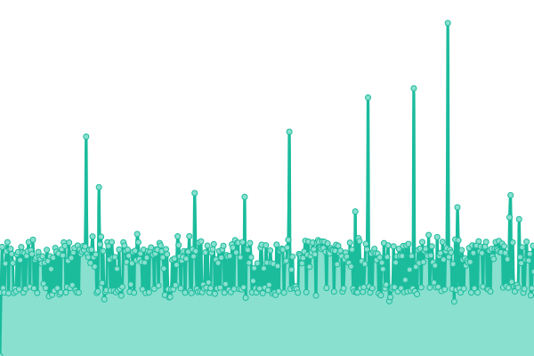
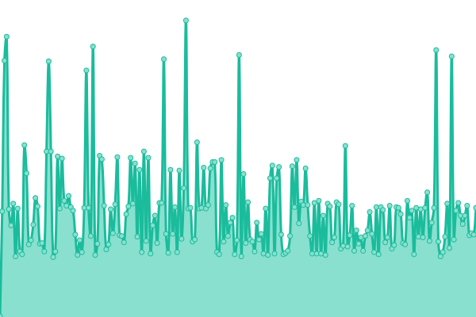
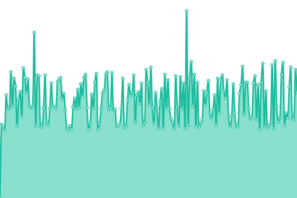
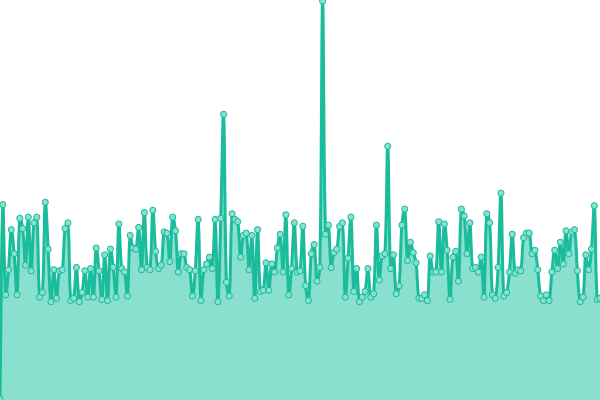

# [📈 Live Status](https://upal212.github.io/status): <!--live status--> **🟧 Partial outage**

<!--start: status pages-->
<!-- This summary is generated by Upptime (https://github.com/upptime/upptime) -->
<!-- Do not edit this manually, your changes will be overwritten -->
<!-- prettier-ignore -->
| URL | Status | History | Response Time | Uptime |
| --- | ------ | ------- | ------------- | ------ |
|  CloudLinkd.com | 🟥 Down | [cloud-linkd-com.yml](https://github.com/upal212/status/commits/HEAD/history/cloud-linkd-com.yml) | 

 85ms
     
 | 

<a href="https://upal212.github.io/status/history/cloud-linkd-com">0.00%</a>
    

|  CloudLinkd Lab | 🟩 Up | [cloud-linkd-lab.yml](https://github.com/upal212/status/commits/HEAD/history/cloud-linkd-lab.yml) | 

 360ms
     
 | 

<a href="https://upal212.github.io/status/history/cloud-linkd-lab">100.00%</a>
    

|  Paris, France | 🟥 Down | [paris-france.yml](https://github.com/upal212/status/commits/HEAD/history/paris-france.yml) | 

 14ms
     
 | 

<a href="https://upal212.github.io/status/history/paris-france">0.00%</a>
    

|  Amsterdam, Netherlands | 🟩 Up | [amsterdam-netherlands.yml](https://github.com/upal212/status/commits/HEAD/history/amsterdam-netherlands.yml) | 

 150ms
     
 | 

<a href="https://upal212.github.io/status/history/amsterdam-netherlands">100.00%</a>
    

|  Frankfurt, Germany | 🟥 Down | [frankfurt-germany.yml](https://github.com/upal212/status/commits/HEAD/history/frankfurt-germany.yml) | 

 14ms
     
 | 

<a href="https://upal212.github.io/status/history/frankfurt-germany">0.00%</a>
    

|  London, United Kingdom | 🟥 Down | [london-united-kingdom.yml](https://github.com/upal212/status/commits/HEAD/history/london-united-kingdom.yml) | 

 14ms
     
 | 

<a href="https://upal212.github.io/status/history/london-united-kingdom">0.00%</a>
    

|  Madrid, Spain | 🟩 Up | [madrid-spain.yml](https://github.com/upal212/status/commits/HEAD/history/madrid-spain.yml) | 

 1704ms
     
 | 

<a href="https://upal212.github.io/status/history/madrid-spain">99.69%</a>
    

|  Montreal, Canada | 🟩 Up | [montreal-canada.yml](https://github.com/upal212/status/commits/HEAD/history/montreal-canada.yml) | 

 150ms
     
 | 

<a href="https://upal212.github.io/status/history/montreal-canada">100.00%</a>
    

|  Singapore | 🟥 Down | [singapore.yml](https://github.com/upal212/status/commits/HEAD/history/singapore.yml) | 

 14ms
     
 | 

<a href="https://upal212.github.io/status/history/singapore">0.00%</a>
    

|  Hyderabad, India | 🟩 Up | [hyderabad-india.yml](https://github.com/upal212/status/commits/HEAD/history/hyderabad-india.yml) | 

 149ms
     
 | 

<a href="https://upal212.github.io/status/history/hyderabad-india">100.00%</a>
    

<!--end: status pages-->

## 📄 License

- Powered by: [CloudLinkd](https://www.cloudlinkd.com)
- Code: [MIT](./LICENSE) © [CloudLinkd](https://www.cloudlinkd.com)
