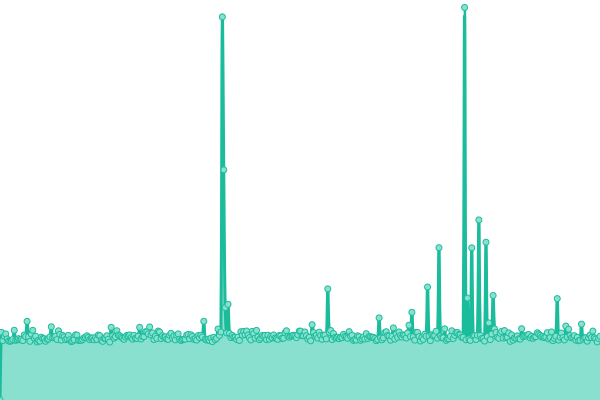

# [📈 Live Status](https://upal212.github.io/status): <!--live status--> **🟩 All systems operational**

<!--start: status pages-->
<!-- This summary is generated by Upptime (https://github.com/upptime/upptime) -->
<!-- Do not edit this manually, your changes will be overwritten -->
<!-- prettier-ignore -->
| URL | Status | History | Response Time | Uptime |
| --- | ------ | ------- | ------------- | ------ |
|  CloudLinkd.com | 🟩 Up | [cloud-linkd-com.yml](https://github.com/upal212/status/commits/HEAD/history/cloud-linkd-com.yml) | 

 4276ms
     
 | 

<a href="https://upal212.github.io/status/history/cloud-linkd-com">99.79%</a>
    

|  CloudLinkd Lab | 🟩 Up | [cloud-linkd-lab.yml](https://github.com/upal212/status/commits/HEAD/history/cloud-linkd-lab.yml) | 

 467ms
     
 | 

<a href="https://upal212.github.io/status/history/cloud-linkd-lab">100.00%</a>
    

|  Paris, France | 🟩 Up | [paris-france.yml](https://github.com/upal212/status/commits/HEAD/history/paris-france.yml) | 

 3610ms
     
 | 

<a href="https://upal212.github.io/status/history/paris-france">100.00%</a>
    

|  Amsterdam, Netherlands | 🟩 Up | [amsterdam-netherlands.yml](https://github.com/upal212/status/commits/HEAD/history/amsterdam-netherlands.yml) | 

 133ms
     
 | 

<a href="https://upal212.github.io/status/history/amsterdam-netherlands">100.00%</a>
    

|  Frankfurt, Germany | 🟩 Up | [frankfurt-germany.yml](https://github.com/upal212/status/commits/HEAD/history/frankfurt-germany.yml) | 

 3565ms
     
 | 

<a href="https://upal212.github.io/status/history/frankfurt-germany">99.04%</a>
    

|  London, United Kingdom | 🟩 Up | [london-united-kingdom.yml](https://github.com/upal212/status/commits/HEAD/history/london-united-kingdom.yml) | 

 3513ms
     
 | 

<a href="https://upal212.github.io/status/history/london-united-kingdom">100.00%</a>
    

|  Montreal, Canada | 🟩 Up | [montreal-canada.yml](https://github.com/upal212/status/commits/HEAD/history/montreal-canada.yml) | 

 136ms
     
 | 

<a href="https://upal212.github.io/status/history/montreal-canada">100.00%</a>
    

|  Singapore | 🟩 Up | [singapore.yml](https://github.com/upal212/status/commits/HEAD/history/singapore.yml) | 

 3686ms
     
 | 

<a href="https://upal212.github.io/status/history/singapore">99.79%</a>
    

|  Hyderabad, India | 🟩 Up | [hyderabad-india.yml](https://github.com/upal212/status/commits/HEAD/history/hyderabad-india.yml) | 

 135ms
     
 | 

<a href="https://upal212.github.io/status/history/hyderabad-india">100.00%</a>
    

<!--end: status pages-->

## 📄 License

- Powered by: [CloudLinkd](https://www.cloudlinkd.com)
- Code: [MIT](./LICENSE) © [CloudLinkd](https://www.cloudlinkd.com)
